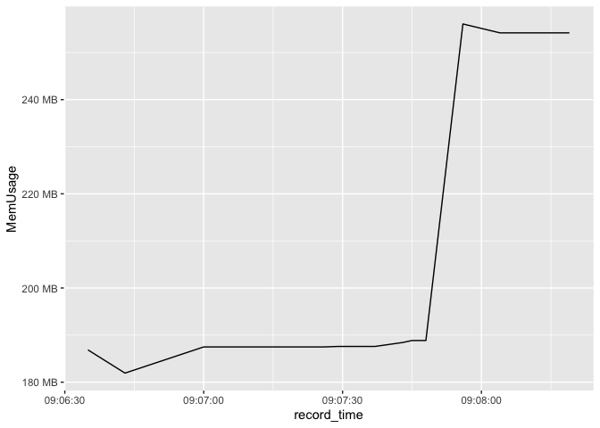

<!-- README.md is generated from README.Rmd. Please edit that file -->

# crrry

<!-- badges: start -->

<!-- badges: end -->

The goal of crrry is to provide some recipes around
[`{crrri}`](https://github.com/RLesur/crrri) for manipulating shiny
applications from the command line.

## Installation

You can install the development version of `{crrry}` from
[GitHub](https://github.com/) with:

``` r
# install.packages("remotes")
remotes::install_github("ColinFay/crrry")
```

## Starting example

Generate a chrome object connection to a specific app (here, online).

(Note: the `randomPort()` function requires httpuv \>= 1.5.2)

``` r
# install.packages("pagedown")
# install.packages("httpuv")
test <- crrry::CrrryOnPage$new(
  chrome_bin = pagedown::find_chrome(),
  chrome_port = httpuv::randomPort(),
  url = "https://connect.thinkr.fr/prenoms/",
  inspect = FALSE,
  headless = FALSE
)
#> Running '/Applications/Google Chrome.app/Contents/MacOS/Google Chrome' \
#>   --no-first-run --new-window \
#>   '--user-data-dir=/Users/colin/Library/Application Support/r-crrri/chrome-data-dir-aycjtvme' \
#>   '--remote-debugging-port=37226'
```

Block the process until shiny is ready to continue:

``` r
test$wait_for_shiny_ready()
#> Shiny is computing
#> ✓ Shiny is still running
```

You can send random JavaScript:

``` r
test$call_js(
      '$("#mod_popuui-dep").click()'
    )
#> ── Launching JS: $("#mod_popuui-dep").click() ──────────────────────
#> Shiny is computing
#> ✓ Shiny is still running
```

Set the value of a shiny input

> Note that this doesn’t change the front, only the backend. You won’t
> see the input change with this one, but the reactivity linked to this
> input changes.

``` r
test$shiny_set_input(
    "mod_popuui-depchoice", 
    "59"
  )
#> ── Setting id mod_popuui-depchoice with value 59 ───────────────────
#> Shiny is computing
#> ✓ Shiny is still running
```

Wait for a condition to be true:

``` r
test$wait_for('$("#mod_popuui-depchoice").text() == "01"')
#> Waiting for cond
#> ✓ Shiny is still running
```

Send some gremlins:

``` r
test$gremlins_horde()
#> ── Sending hordes of gremlins ──────────────────────────────────────
#> Shiny is computing
#> ✓ Shiny is still running
```

Stop the process:

``` r
test$stop()
```

## Use on a local app

``` r
test <- crrry::CrrryProc$new(
  chrome_bin = pagedown::find_chrome(),
  chrome_port = 6697L,
  fun = "hexmake::run_app()",
  inspect = FALSE,
  headless = FALSE
)
#> Running '/Applications/Google Chrome.app/Contents/MacOS/Google Chrome' \
#>   --no-first-run --new-window \
#>   '--user-data-dir=/Users/colin/Library/Application Support/r-crrri/chrome-data-dir-nouhxpua' \
#>   '--remote-debugging-port=6697'
```

``` r
test$stop()
```

## Perform a load test

In combination with `{dockerstats}`

``` r
system("docker run -p 2708:80 --rm --name hexmake colinfay/hexmake", wait = FALSE)
Sys.sleep(5)
library(dockerstats)

unlink("inst/dockerstatsss.csv")

tests <- list()

n_users <- 4

append_csv <- function(
  message,
  i
){
  readr::write_csv(
    append = TRUE,
    dockerstats::dockerstats("hexmake", extra = sprintf(
      "%s - %s", message, i
    )),
    "inst/dockerstatsss.csv"
  )
}


for (i in 1:n_users){
  cli::cat_rule(as.character(i))
  tests[[i]] <- crrry::CrrryOnPage$new(
    chrome_bin = pagedown::find_chrome(),
    chrome_port = httpuv::randomPort(),
    url = "http://localhost:2708",
    inspect = FALSE,
    headless = FALSE
  )
  append_csv( "Connection", i)
}
#> ── 1 ───────────────────────────────────────────────────────────────
#> Running '/Applications/Google Chrome.app/Contents/MacOS/Google Chrome' \
#>   --no-first-run --new-window \
#>   '--user-data-dir=/Users/colin/Library/Application Support/r-crrri/chrome-data-dir-wwjntbuh' \
#>   '--remote-debugging-port=32913'
#> ── 2 ───────────────────────────────────────────────────────────────
#> Running '/Applications/Google Chrome.app/Contents/MacOS/Google Chrome' \
#>   --no-first-run --new-window \
#>   '--user-data-dir=/Users/colin/Library/Application Support/r-crrri/chrome-data-dir-ngjgynts' \
#>   '--remote-debugging-port=26054'
#> ── 3 ───────────────────────────────────────────────────────────────
#> Running '/Applications/Google Chrome.app/Contents/MacOS/Google Chrome' \
#>   --no-first-run --new-window \
#>   '--user-data-dir=/Users/colin/Library/Application Support/r-crrri/chrome-data-dir-bqaugpqy' \
#>   '--remote-debugging-port=45583'
#> ── 4 ───────────────────────────────────────────────────────────────
#> Running '/Applications/Google Chrome.app/Contents/MacOS/Google Chrome' \
#>   --no-first-run --new-window \
#>   '--user-data-dir=/Users/colin/Library/Application Support/r-crrri/chrome-data-dir-eqgxctig' \
#>   '--remote-debugging-port=2100'

for (i in 1:n_users){
  Sys.sleep(0.5)
  cli::cat_rule(as.character(i))
  tests[[i]]$call_js('$("summary:contains(\'Name\')").click()')
  append_csv( "Clicking on Name", i)
}
#> ── 1 ───────────────────────────────────────────────────────────────
#> ── Launching JS: $("summary:contains('Name')").click() ─────────────
#> Shiny is computing
#> ✓ Shiny is still running
#> ── 2 ───────────────────────────────────────────────────────────────
#> ── Launching JS: $("summary:contains('Name')").click() ─────────────
#> Shiny is computing
#> ✓ Shiny is still running
#> ── 3 ───────────────────────────────────────────────────────────────
#> ── Launching JS: $("summary:contains('Name')").click() ─────────────
#> Shiny is computing
#> ✓ Shiny is still running
#> ── 4 ───────────────────────────────────────────────────────────────
#> ── Launching JS: $("summary:contains('Name')").click() ─────────────
#> Shiny is computing
#> ✓ Shiny is still running

for (i in 1:n_users){
  Sys.sleep(0.5)
  cli::cat_rule(as.character(i))
  tests[[i]]$shiny_set_input(
    "main_ui_1-left_ui_1-pkg_name_ui_1-package", 
    "pouet"
  )
  append_csv( "Changin pkg name", i)
}
#> ── 1 ───────────────────────────────────────────────────────────────
#> ── Setting id main_ui_1-left_ui_1-pkg_name_ui_1-package with value p
#> Shiny is computing
#> ✓ Shiny is still running
#> ── 2 ───────────────────────────────────────────────────────────────
#> ── Setting id main_ui_1-left_ui_1-pkg_name_ui_1-package with value p
#> Shiny is computing
#> ✓ Shiny is still running
#> ── 3 ───────────────────────────────────────────────────────────────
#> ── Setting id main_ui_1-left_ui_1-pkg_name_ui_1-package with value p
#> Shiny is computing
#> ✓ Shiny is still running
#> ── 4 ───────────────────────────────────────────────────────────────
#> ── Setting id main_ui_1-left_ui_1-pkg_name_ui_1-package with value p
#> Shiny is computing
#> ✓ Shiny is still running

for (i in 1:n_users){
  Sys.sleep(0.5)
  cli::cat_rule(as.character(i))
  tests[[i]]$gremlins_horde()
  Sys.sleep(5)
  append_csv( "gremlins", i)
}
#> ── 1 ───────────────────────────────────────────────────────────────
#> ── Sending hordes of gremlins ──────────────────────────────────────
#> Shiny is computing
#> ✓ Shiny is still running
#> ── 2 ───────────────────────────────────────────────────────────────
#> ── Sending hordes of gremlins ──────────────────────────────────────
#> Shiny is computing
#> ✓ Shiny is still running
#> ── 3 ───────────────────────────────────────────────────────────────
#> ── Sending hordes of gremlins ──────────────────────────────────────
#> Shiny is computing
#> ✓ Shiny is still running
#> ── 4 ───────────────────────────────────────────────────────────────
#> ── Sending hordes of gremlins ──────────────────────────────────────
#> Shiny is computing
#> ✓ Shiny is still running

for (i in 1:n_users){
  Sys.sleep(0.5)
  cli::cat_rule(as.character(i))
  tests[[i]]$stop()
}
#> ── 1 ───────────────────────────────────────────────────────────────
#> ── 2 ───────────────────────────────────────────────────────────────
#> ── 3 ───────────────────────────────────────────────────────────────
#> ── 4 ───────────────────────────────────────────────────────────────
system("docker kill hexmake")
```

Analyse results

``` r
df <- readr::read_csv(
  "inst/dockerstatsss.csv", 
  col_names = names(dockerstats::dockerstats())
  )
#> Parsed with column specification:
#> cols(
#>   Container = col_character(),
#>   Name = col_character(),
#>   ID = col_character(),
#>   CPUPerc = col_double(),
#>   MemUsage = col_character(),
#>   MemLimit = col_character(),
#>   MemPerc = col_double(),
#>   NetI = col_character(),
#>   NetO = col_character(),
#>   BlockI = col_character(),
#>   BlockO = col_character(),
#>   PIDs = col_double(),
#>   record_time = col_datetime(format = ""),
#>   extra = col_character()
#> )
df$MemUsage <- fs::as_fs_bytes(
  df$MemUsage
)
library(ggplot2)
ggplot() + 
  geom_line(data = df, aes(x = record_time, y = MemUsage)) + 
  scale_y_continuous(labels = scales::label_bytes())
```


